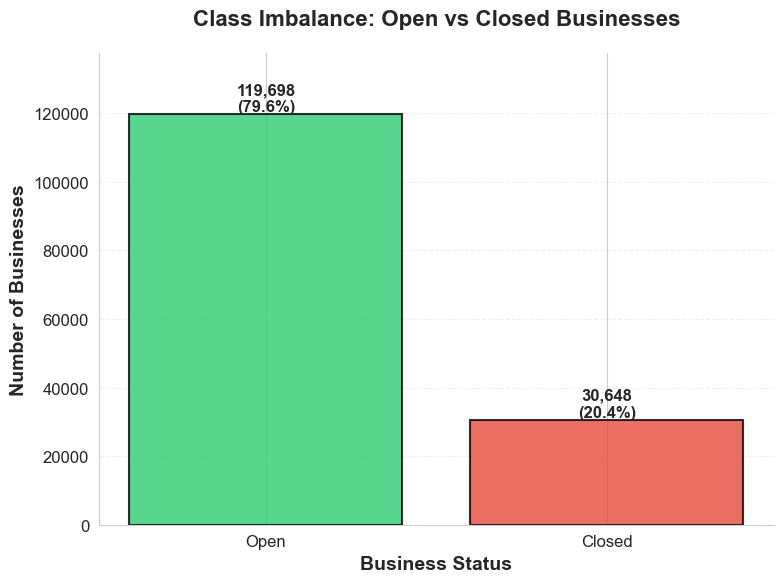
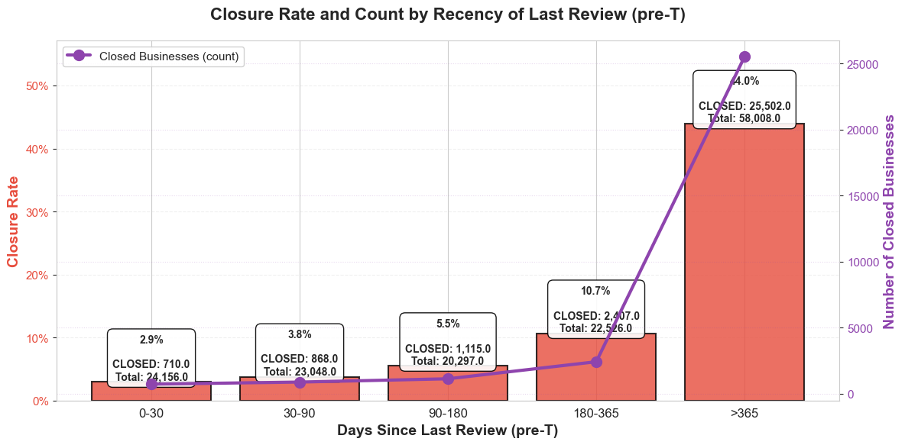
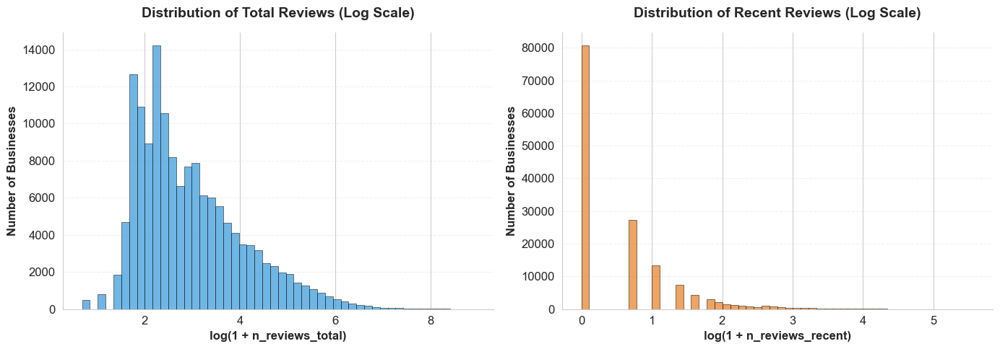
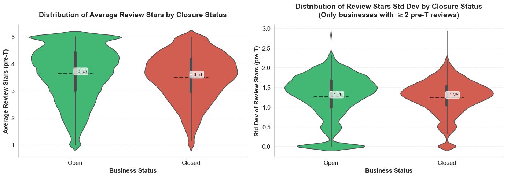

# Predicting Business Closures and Star Ratings Using the Yelp Open Dataset

**Kirill Sirik** · Princeton University · SML301 Final Project · December 2025

[**📄 Full report (PDF)**](report/SML301_Final_Project.pdf) · [**📊 Presentation slides (PDF)**](presentation/SML301_Final_Presentation.pdf) · [**📓 Analysis notebook**](notebooks/final_project_code.ipynb) ([view in nbviewer](https://nbviewer.org/github/ks2850/Yelp-Open-Dataset-Project/blob/main/notebooks/final_project_code.ipynb))

Using the [Yelp Open Dataset](https://business.yelp.com/data/resources/open-dataset/) — 150,346 businesses and ~7 million reviews across 11 metropolitan areas — this project asks two questions:

1. **Classification:** Can we predict whether a business is closed after a cutoff date *T*?
2. **Regression:** For businesses that remain open, can we predict their average star rating after *T*?

The project benchmarks classical machine-learning models against feed-forward neural networks under a strictly **leakage-aware** design: every feature is computed only from information dated on or before *T* = 2020-12-31, and Yelp's own pre-aggregated `stars` and `review_count` fields are discarded (they mix in post-*T* information) and recomputed manually from pre-*T* reviews.

## Key results

**Closure classification** (held-out test set, full feature set):

| Model | Accuracy | Precision | Recall | F1 | ROC-AUC | PR-AUC |
|---|---|---|---|---|---|---|
| Logistic Regression (L2) | 0.755 | 0.446 | 0.764 | 0.563 | 0.843 | 0.629 |
| Calibrated Ridge Classifier | 0.821 | 0.664 | 0.271 | 0.385 | 0.777 | 0.520 |
| Decision Tree | 0.756 | 0.451 | 0.831 | 0.585 | 0.853 | 0.613 |
| Random Forest | **0.862** | **0.764** | 0.478 | 0.588 | 0.877 | 0.705 |
| MLP-1 (1 hidden layer) | 0.803 | 0.516 | 0.786 | 0.623 | 0.875 | 0.700 |
| MLP-2 (2 hidden layers) | 0.816 | 0.538 | 0.778 | **0.636** | **0.879** | **0.716** |

- **MLP-2 wins on ROC-AUC (0.879) and PR-AUC (0.716)** — the metrics that matter most given the ~20% closure rate — with random forest the strongest classical model (ROC-AUC 0.877, PR-AUC 0.705).
- **Customer-engagement features dominate.** In a feature-group ablation, REVIEW-derived features alone reach ROC-AUC 0.862, vs. 0.607 for geography and 0.704 for business attributes.
- The single most protective feature is **recent review volume** (L1-logistic coefficient −2.65): businesses whose last pre-*T* review is over a year old close at a 44.0% rate, vs. 2.9% for businesses reviewed within 30 days — a ~15× difference.

**Star-rating regression** (open businesses with ≥ 3 post-*T* reviews):

| Model | MSE | RMSE | MAE | R² |
|---|---|---|---|---|
| Ridge Regression | 0.6647 | 0.8153 | 0.6275 | 0.5200 |
| Random Forest | **0.6518** | **0.8074** | 0.6210 | **0.5293** |
| MLP-1 | 0.6565 | 0.8103 | **0.6205** | 0.5259 |
| MLP-2 | 0.6988 | 0.8359 | 0.6528 | 0.4954 |

- Random forest performs best (R² ≈ 0.53); simple MLPs match, but do not beat, tree ensembles on this tabular task.

## Selected figures

| | |
|---|---|
|  |  |
| *~20.4% of businesses are closed — PR-AUC is emphasized accordingly.* | *Closure rate rises ~15× as the last pre-T review ages from <30 days to >1 year.* |
|  |  |
| *Review volume is heavily right-skewed; most businesses have zero recent reviews.* | *Average ratings barely separate open vs. closed businesses — engagement, not sentiment, predicts closure.* |

## Method overview

- **Data:** five Yelp JSON files (`business`, `review`, `tip`, `checkin`, `user`); 6.34M reviews dated on or before *T*. Businesses first reviewed after *T* are excluded; every business needs ≥ 1 pre-*T* review.
- **Features (three disjoint groups + their union):**
  - `GEO` — latitude, longitude, city, state
  - `BUSINESS` — primary category
  - `REVIEW` — pre-*T* engagement aggregates: total/recent review counts (180-day window), average/std of stars, review length, tip counts and lengths, and check-in counts
- **Preprocessing:** a shared scikit-learn `ColumnTransformer` (median imputation + standardization for numeric; mode imputation + one-hot encoding for categorical).
- **Tuning:** stratified 5-fold `GridSearchCV` (ROC-AUC) for classical models; 3-fold `RandomizedSearchCV` over 8 configurations for the Keras MLPs (units, dropout, L2, learning rate, batch size), with early stopping and learning-rate scheduling. Each best configuration is refit on the full training split and evaluated once on the 20% held-out test set.

## Repository structure

```
├── README.md
├── requirements.txt
├── notebooks/
│   └── final_project_code.ipynb      # Full pipeline: EDA → features → models → evaluation
├── report/
│   └── SML301_Final_Project.pdf      # Final write-up (25 pages)
├── presentation/
│   └── SML301_Final_Presentation.pdf # Slide deck
└── figures/                          # Key figures (exported from the notebook)
```

## Reproducing the analysis

1. Download the Yelp Open Dataset from [Yelp](https://business.yelp.com/data/resources/open-dataset/) and place the `yelp_academic_dataset_*.json` files in the notebook's working directory.
2. Install dependencies: `pip install -r requirements.txt`
3. Run `notebooks/final_project_code.ipynb` top to bottom. The review file is ~5 GB, so the full pipeline takes several hours; all outputs from the original run are preserved in the notebook.

## Data availability

The Yelp Open Dataset is proprietary and distributed by Yelp under its own [Dataset License](https://business.yelp.com/data/resources/open-dataset/) for academic use. **No data files are included in this repository**; only code, figures, and the write-up are published here.

## Acknowledgements

Completed as the final project for SML301 at Princeton University. AI assistants were used to help write and debug code, as permitted by the course; the full AI-use statement is in the report.
